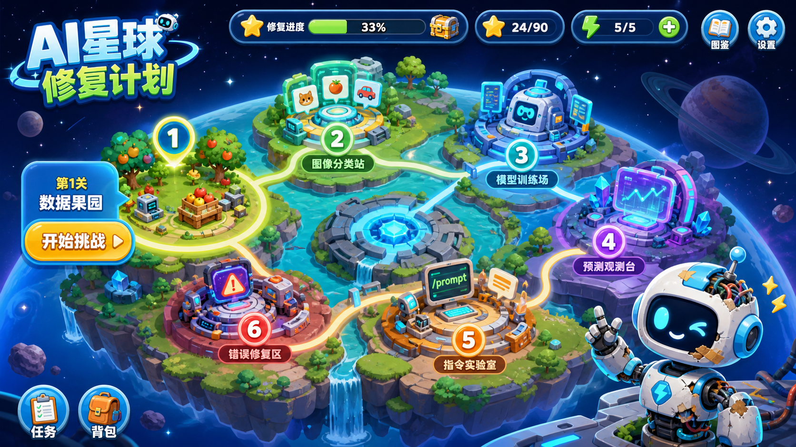
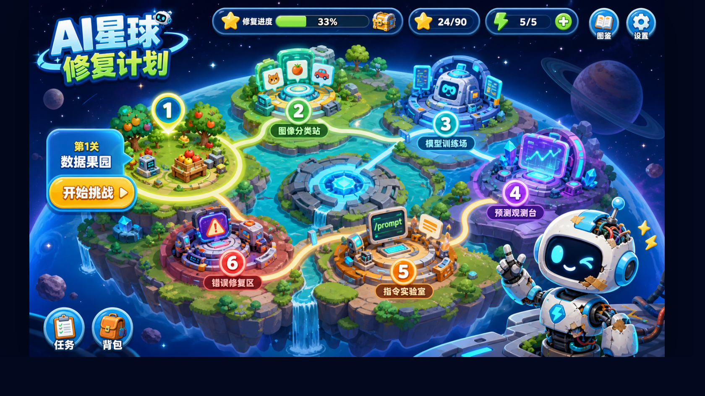

# image2html

`image2html` 是一个 Codex Skill，用来把高质量图片、AI 生成的 UI 设计图、截图、落地页 mockup、App 界面或游戏画面，尽量精准地还原成可运行的 HTML/CSS/JS。

> 核心理念：图片不是灵感板，而是验收标准。先拆图，再编码，再用浏览器截图对比，直到实现结果接近原图。

English summary: `image2html` helps Codex rebuild visual references as faithful, responsive HTML/CSS/JS, with browser screenshot verification as part of the workflow.

## 为什么需要它

AI 很容易生成一张“看起来很漂亮”的设计图，但把这张图变成真正可运行的前端页面时，常见问题很多：

- 布局比例不像原图
- 字体层级和间距跑偏
- 色彩氛围变了
- 图片里的控件没有真实交互
- 移动端响应式没有验收
- 只做了“差不多”的页面，没有截图对比

`image2html` 给 Codex 增加了一套更严谨的工作流：

1. 先分析图片里的布局、颜色、字体、组件和交互暗示
2. 再选择静态 HTML 或现有前端框架实现
3. 抽取设计 token 和组件结构
4. 实现真实按钮、状态、热点、滑杆、弹窗等交互
5. 用桌面端和移动端浏览器截图验收
6. 根据截图差异继续微调

## 真实案例：Kids Game

下面这个案例来自 `D:\kidsgame` 项目。输入是一张 AI 生成的儿童游戏地图设计图，主题是“AI星球修复计划”。目标不是重新画一张类似的图，而是把它变成可运行、可点击、可验证的 HTML 游戏界面。

### 输入：AI 生成的游戏界面参考图



这张图已经包含很强的视觉方向：

- 儿童向游戏地图
- 星球/关卡路线
- 顶部 HUD 状态条
- 左侧开始挑战按钮
- 右上角图鉴和设置
- 底部任务、背包入口
- 机器人角色和 6 个关卡点

但它本质上还是一张扁平图片，不能点击、不能响应、不能进入真实游戏流程。

### 输出：HTML 还原后的桌面端截图



`image2html` 引导 Codex 采用“高保真视觉层 + 语义化交互热点”的策略：

- 保留原图作为主视觉层，最大程度维持视觉还原度
- 在关卡、开始挑战、任务、背包、图鉴、设置等位置叠加真实按钮
- 用 HTML dialog 实现关卡弹窗
- 用 JS 管理关卡状态、反馈、按钮状态和快捷关闭
- 用 CSS 添加星光、路线流动、关卡光环等轻量动效
- 用浏览器截图确认桌面端比例和视觉位置

### 输出：移动端截图


移动端验收的重点不是把 16:9 游戏地图硬塞满屏幕，而是确认：

- 游戏画面保持比例
- 没有横向布局错误
- 关键点击区域仍然存在
- 页面在手机视口下可展示和测试
- 后续可以继续扩展为横屏游戏体验

### 这个案例体现的价值

`image2html` 的价值不是“把图片转成网页”这么简单，而是把一张视觉概念图变成一个可以继续开发的前端基础：

| 阶段 | 普通做法 | 使用 image2html |
|---|---|---|
| 视觉理解 | 凭感觉照着写 | 先做视觉审计，拆布局/颜色/组件 |
| 还原策略 | 重新画一个类似页面 | 根据素材情况选择高保真图层或组件化重建 |
| 交互 | 图片不可点击 | 叠加真实按钮、弹窗、状态反馈 |
| 验收 | 主观说“差不多” | 桌面/移动端截图对比 |
| 交付 | 一次性 demo | 可继续迭代的 HTML/CSS/JS |

这个 Kids Game 案例尤其适合说明：当只有一张扁平 PNG、没有分层设计稿时，`image2html` 仍然可以先交付一个高保真的可交互原型，让团队快速验证玩法入口、热点区域、弹窗流程和响应式策略。

## 适用场景

你可以用 `image2html` 处理：

- AI 生成的 UI 设计图
- 产品落地页 mockup
- 移动 App 概念图
- 游戏界面概念图
- Dashboard 截图
- 编辑器/工具类界面
- 海报式 hero 页面
- 需要快速变成 HTML 原型的视觉参考图

示例提示词：

```text
使用 image2html，把这张 AI 生成的落地页图还原成响应式 HTML 页面。
```

```text
使用 image2html，把这个 dashboard 截图还原到当前 React 项目里，并做桌面端和移动端截图验收。
```

```text
使用 image2html，把这个儿童游戏界面图转成可点击的 HTML 原型，关卡和开始按钮需要能弹出交互。
```

## 它会产出什么

根据当前项目环境，Codex 会选择：

- 独立静态 HTML/CSS/JS 页面
- 或者在现有 React、Vue、Svelte、Next.js、Vite 等项目中实现

当没有现成前端项目时，可以使用内置 starter：

```text
assets/starter/
├─ index.html
├─ styles.css
└─ script.js
```

## 安装方式

### 安装到 Codex Skills 目录

Windows PowerShell：

```powershell
git clone https://github.com/atian8179/image2html.git $env:USERPROFILE\.codex\skills\image2html
```

macOS / Linux：

```bash
git clone https://github.com/atian8179/image2html.git ~/.codex/skills/image2html
```

安装后，重启 Codex 或新开一个会话，让 Skill 被自动发现。

### 从本地路径直接使用

如果你暂时不想安装到全局 skills 目录，也可以直接在提示词里引用路径：

```text
使用 /path/to/image2html 这个 skill，把这张图还原成 HTML。
```

## 仓库结构

```text
image2html/
├─ SKILL.md
├─ agents/
│  └─ openai.yaml
├─ assets/
│  ├─ cases/
│  │  └─ kidsgame/
│  │     ├─ reference.png
│  │     ├─ desktop-check.png
│  │     └─ mobile-check.png
│  └─ starter/
│     ├─ index.html
│     ├─ styles.css
│     └─ script.js
└─ references/
   ├─ html-css-rebuild-patterns.md
   └─ visual-audit-checklist.md
```

## 工作流摘要

Codex 使用这个 Skill 时，应该遵循下面的循环：

1. 观察图片，写出简洁视觉分析
2. 判断实现目标：静态 HTML 还是现有前端项目
3. 把图片拆成布局区域和组件
4. 提炼颜色、字体、间距、圆角、阴影等设计 token
5. 处理关键图片资产
6. 实现必要的交互状态
7. 做响应式适配
8. 截取桌面端和移动端浏览器截图
9. 对照原图检查差异
10. 继续调整，直到视觉上接近原图

## 还原标准

可以接受：

- 字体渲染有轻微差异
- 图标有小幅替换
- 非关键图片细节略有不同
- 浏览器渲染造成的小差异

不能接受：

- 主要区域缺失
- 布局明显不同
- 色彩氛围变了
- 间距节奏混乱
- 文本重叠或被裁切
- 用无意义占位内容替代关键视觉
- 没有做移动端和桌面端验收

## 截图验收示例

典型 Playwright 验收流程：

```js
const { chromium } = require('playwright');

const browser = await chromium.launch({ headless: true });
const page = await browser.newPage({ viewport: { width: 1440, height: 960 } });

await page.goto('http://127.0.0.1:5173', { waitUntil: 'networkidle' });
await page.screenshot({ path: 'desktop-check.png', fullPage: true });

await page.setViewportSize({ width: 390, height: 844 });
await page.screenshot({ path: 'mobile-check.png', fullPage: true });

await browser.close();
```

如果 Playwright 自带浏览器不可用，可以改用系统里已经安装的 Chromium 或 Microsoft Edge。

## 推荐提示词

```text
使用 image2html，把这张图片还原成响应式 HTML/CSS/JS。

要求：
- 尽量匹配原图的布局、间距、颜色和字体层级
- 实现明显的交互，比如按钮、标签页、弹窗、滑杆或选中状态
- 做桌面端和移动端截图验收
- 最后说明还原差异和后续可优化点
```

## English Quick Start

Install:

```bash
git clone https://github.com/atian8179/image2html.git ~/.codex/skills/image2html
```

Use:

```text
Use image2html to rebuild the attached image as a responsive HTML/CSS/JS prototype. Verify it with desktop and mobile browser screenshots.
```

## License

No license file is included yet. Add a license before relying on this repository for broader open-source distribution.
